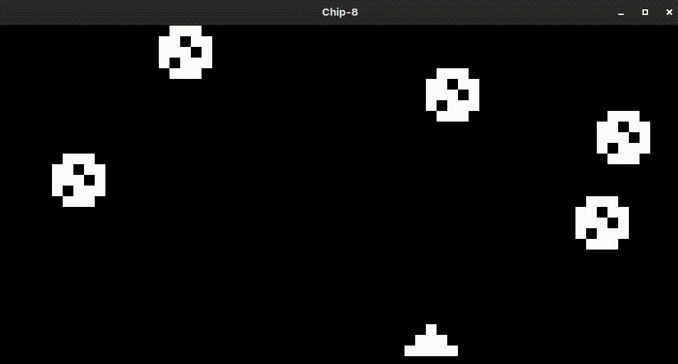
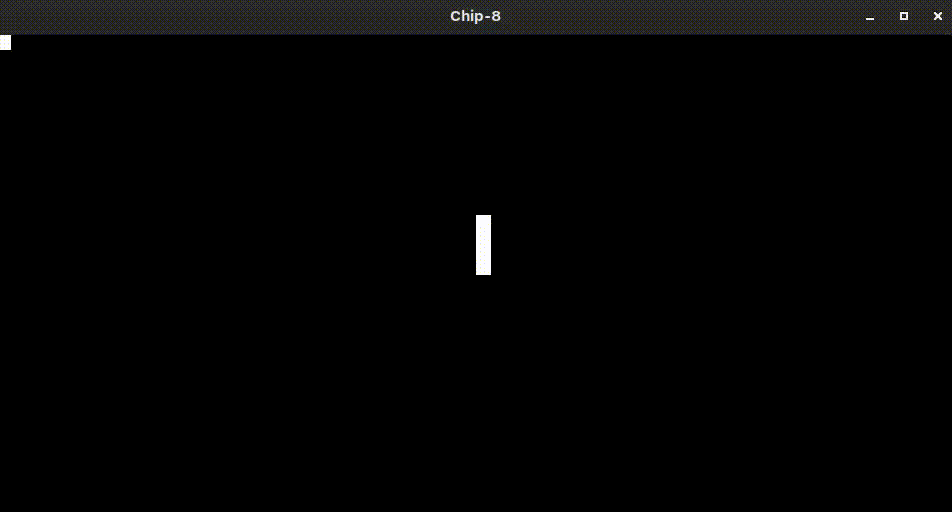
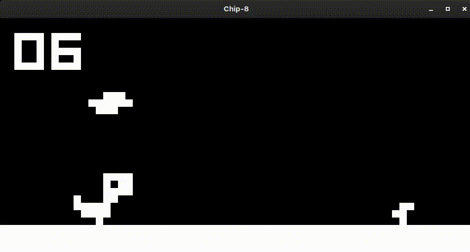

# Pixel Forge

Pixel Forge is an emulator virtual machine designed to run Chip8 and Super-Chip ROMs.

Dodge on Chip-8


Snake on Chip-8


Dinogame on Chip-8


## Installation

The release section of this repository contains pre-compiled binaries for macOS, Windows and Linux. Download the .zip file, extract it and run the executable to use to emulator.

### Local Compilation

You can also compile the binary on your local machine with ease.

#### Dependencies

 > C++ 20 (or higher)
 > CMake 3.11+
 > GLFW3

Run CMake to compile the binary

```
cmake -S . -B build
cmake --build build -j $(nproc)
```

The binary will be available in `build/PixelForge`

## How to Play

Double click on the binary or use the terminal to execute it `./PixelForge`

The emulator starts with a black screen. Drag and drop any chip-8 or SCHIP game ROM into this window to start the emulator.

### Keypad mapping

Chip-8 emulator keypad map:

| 1 | 2 | 3 | C |
|---|---|---|---|
| 4 | 5 | 6 | D |
| 7 | 8 | 9 | E |
| A | 0 | B | F |

Corresponding keyboard keys:

| 1 | 2 | 3 | 4 |
|---|---|---|---|
| Q | W | E | R |
| A | S | D | F |
| Z | X | C | V | 

## Features

 * Cross platform support: The executable can be compiled on linux, windows and macOS.
 * Chip-8 extension support: The emulator supports ROMs from the original Chip-8, Super-Chip and XO Chip.
 * Hardware quirks support: The hardware has been modeled for configurable hardware quirks.
 * CPU Freuency: The emulator CPU runs at 700Hz, however that can be easily modified by the changing the `EMULATOR_FREQUENCY` constant in `include/system.hh`
 * Dynamic resolution scaling: The game can switch between a low resolution (`64x32`) and high resolution (`128x64`) display modes.

## Project Structure

 > src/Processor: CPU instructions, fetch, decode, execute, call stack.
 > src/IO: keypad state management.
 > src/Memory: System RAM (4KB) load, store.
 > src/Timer: Delay and Sound timer states, set, decrement
 > src/Display: Pixel buffer of the screen, clear, scroll, etc.
 > src/Util: Emulator window manager and ROM loader components
## Known Bugs

 * Emulator window crashes on drag and drop hover in wayland compositors
 * No sound 

## AI Usage 

 * AI was used for understanding the inner state of the emulator
 * Completion of repetitive tasks (such as ISA definition)
 * OpenGL state management and pixel texture buffer uploads

## Resources

https://austinmorlan.com/posts/chip8_emulator/
https://github.com/JohnEarnest/chip8Archive
https://johnearnest.github.io/Octo/docs/chip8ref.pdf
http://devernay.free.fr/hacks/chip8/chip8def.htm